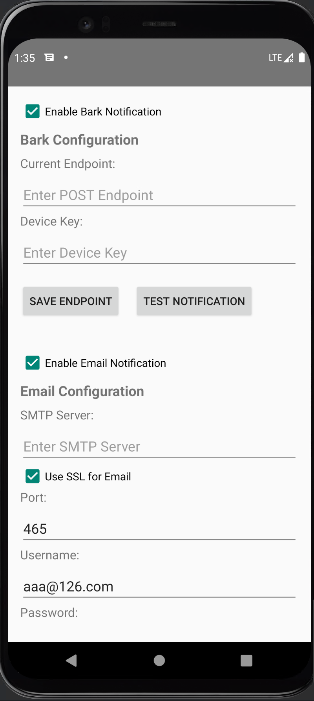
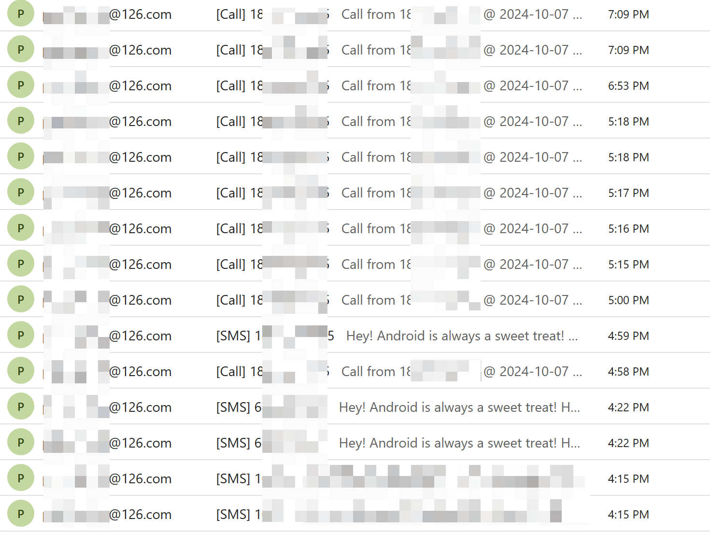
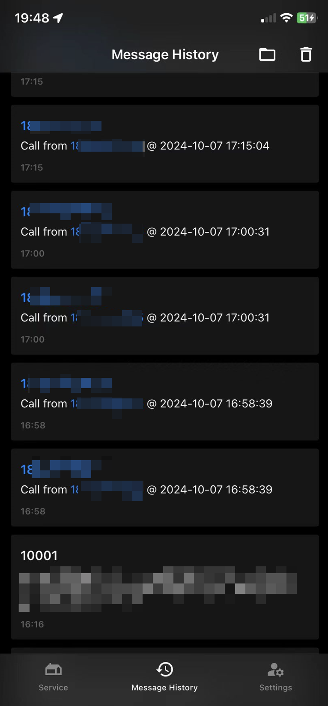
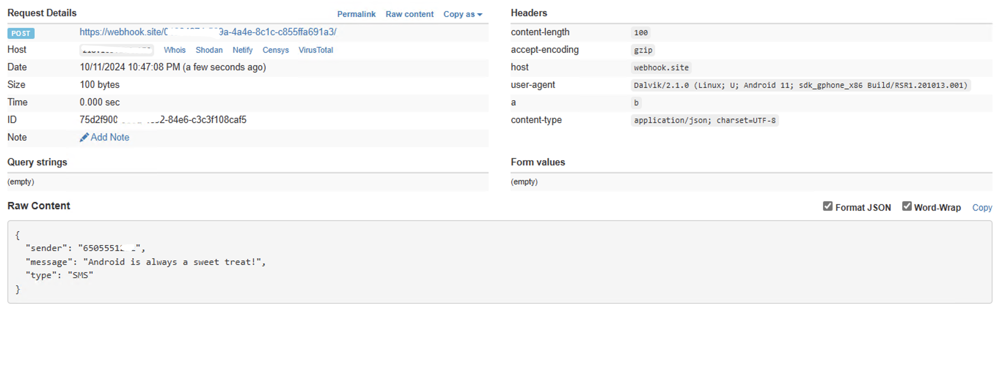

# Android Call & SMS Forwarder App

This Android application captures incoming calls and SMS messages, and forwards the data to a Bark server, via email, or through a webhook. You can receive notifications on other devices using the Bark app, email, or by setting up a custom webhook.

## Features
- Capture incoming calls and SMS messages.
- Forward call and SMS information to a Bark server.
- Send email notifications with call and SMS information.
- Forward call and SMS information to a custom webhook endpoint.
- Receive notifications on other devices using the Bark app.
- Dual SIM card support.

## Screenshots

__App Screen__

__Notification Emails__

__Bark Notifications__

__Webhook Notifications__

## Prerequisites (Optional if only using Email or Webhook notifications)
1. **Bark Server Setup**: Set up your Bark server by following the instructions provided in the [Bark Server GitHub repository](https://github.com/Finb/bark-server/blob/master/README.md).

2. You can also use the [Bark public server](https://bark.day.app/) if you don't want to set up your own. However, it is not recommended considering privacy.

## Installation Instructions
1. **Download the App**
   - Navigate to the [Releases](https://github.com/jinweijie/notify-me/releases) section of this repository.
   - Download the latest version of the APK.

2. **Install the App**
   - Transfer the APK file to your Android device.
   - Install the APK by opening the file and following the on-screen prompts.

3. **App Permissions**
   - After installation, make sure to grant the following permissions:
     - **SMS**: To capture incoming SMS messages.
     - **Phone Calls**: To capture incoming call details.
     - **Autostart**: Enable the app to start automatically when the phone reboots.

## Setup Instructions
1. **Configure Bark Server URL**
   - Open the app and configure the Bark server URL to forward incoming messages.
   - You can obtain the base URL from your Bark server setup (e.g., `http://your-bark-server-url/...`).

2. **Configure Email Notification**
   - Open the app and navigate to the email configuration section.
   - Provide the recipient email address where notifications should be sent.
   - Enable the **useSSL** option if your email server requires a secure connection.

3. **Configure Webhook**
   - Open the app and navigate to the webhook configuration section.
   - Provide the **Webhook Endpoint URL** where incoming call and SMS information should be forwarded.
   - Optionally, you can add **Webhook Headers** (e.g., authentication tokens) to include in the HTTP request.

## Usage
- Once installed and configured, the app will run in the background.
- It will capture incoming calls and SMS messages and automatically forward them to the configured Bark server, via email, or through the webhook endpoint.
- Notifications will be sent to devices that have the Bark app installed, to the configured email address, or to the webhook server.

## Notes
- Ensure the app is not restricted by battery optimization settings to allow continuous background operation.
- Make sure that the Bark server or webhook endpoint is set up and running properly to receive notifications.
- Ensure correct email and webhook configurations for notifications to be successfully sent.

## Troubleshooting
- If the app stops forwarding messages, ensure it has all necessary permissions and is allowed to run in the background.
- Check the Bark server or webhook setup to ensure it's correctly configured to accept forwarded messages.
- Verify that the email configuration is correct and that the app can access the internet to send emails.

# License
This project is licensed under the [WTFPL License](http://www.wtfpl.net). This license allows you to freely use, modify, and distribute the software. For more details, see the [WTFPL License](http://www.wtfpl.net)
